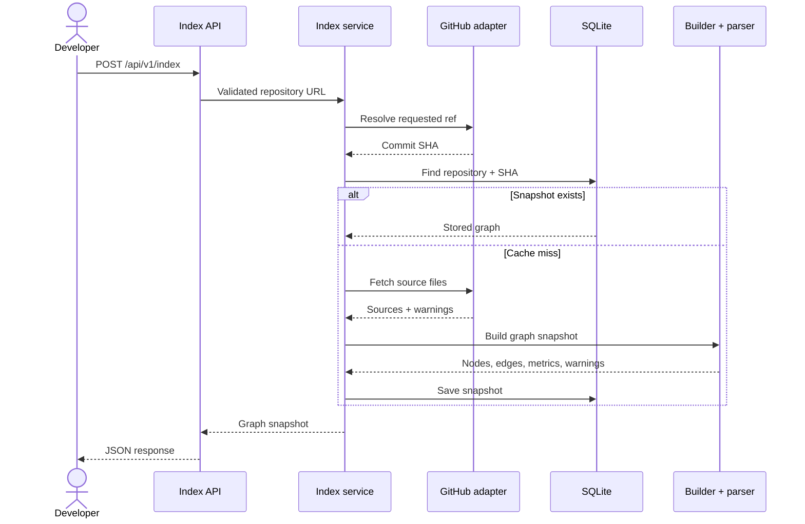

<div align="center">


**Turn source code into a map you can inspect.**
Paste a GitHub URL, get an AST-derived map of how the code actually connects.

[](https://github.com/pacman-cli/Cartograph/actions/workflows/ci.yml)
[](LICENSE)
[](https://openjdk.java.net/projects/jdk/17/)
[](https://spring.io/projects/spring-boot)
[](https://github.com/pacman-cli/Cartograph/stargazers)
[](https://github.com/pacman-cli/Cartograph/graphs/contributors)
[](CONTRIBUTING.md)
[](CONTRIBUTING.md)

[Quickstart](#-quickstart) · [How it works](#-how-it-works) · [Architecture](#️-architecture) · [Roadmap](#-roadmap) · [Contributing](#-contributing)

</div>

---

## 🗺️ Why Cartograph?

Understanding an unfamiliar repository should start with the source. Cartograph **fetches a GitHub repository, parses it with [tree-sitter](https://tree-sitter.github.io/tree-sitter/), and builds a graph** of extracted symbols and relationships. Warnings expose unsupported files and incomplete analysis. Static analysis is deliberately limited: dynamic dispatch and unresolved references are not guarantees about runtime behavior.

- **Paste a URL, get a map.** One `POST /api/v1/index` call turns `github.com/owner/repo` into a structured graph snapshot.
- **AST-accurate, not LLM-hallucinated.** Symbols, call sites, and edges are extracted by deterministic parsers, with warnings when coverage is incomplete.
- **Snapshots, not re-fetches.** Results are persisted in SQLite, keyed by commit SHA — the same commit returns the same cached graph.
- **Bounded ingestion.** File-count, content-byte, and response-size limits reject oversized inputs; retries and timeouts bound individual upstream operations.
- **An honest, open roadmap.** 90+ planned features tracked wave by wave in public. We're at the beginning — perfect time to join.

> **Status:** backend walking skeleton on `main` — 63 tests green, and the first live index of a public repository already works (`sindresorhus/is` → 242 nodes, 487 edges). In flight: GitHub client resilience — bounded retries, timeouts, ETag reuse, SHA-pinned fetches (feature F0.08). The graph viewer UI and async jobs are the next waves. See [Roadmap](#-roadmap).

## ⚡ Quickstart

**Prerequisites:** Java 17 and Maven. SQLite is embedded. Public-repository requests can run without a token; an optional server-side `GITHUB_TOKEN` provides authenticated GitHub access. Initial Maven dependency downloads and live indexing require internet access.

```bash
# 1. Clone and start the API
git clone https://github.com/pacman-cli/Cartograph.git
cd Cartograph
mvn spring-boot:run
```

```bash
# 2. Try a public repository containing supported JavaScript/TypeScript files
curl -X POST http://localhost:8080/api/v1/index \
  -H 'Content-Type: application/json' \
  -d '{"repositoryUrl":"https://github.com/sindresorhus/is"}'
```

Illustrative response shape (empty graph shown; live counts and SHAs vary):

```json
{
  "repository": "owner/repo",
  "commitSha": "0123456789abcdef0123456789abcdef01234567",
  "nodes": [],
  "edges": [],
  "warnings": [],
  "metrics": { "filesSeen": 0, "filesParsed": 0, "nodes": 0, "edges": 0 }
}
```

Nodes carry `stableId`, `kind`, `name`, `filePath`, and line/column ranges. Edges carry `fromId`, `toId`, `kind`, `confidence`, and `location`. See the [response DTO](src/main/java/com/cartograph/api/GraphSnapshotResponse.java) and [graph models](src/main/java/com/cartograph/graph/model).

Run the offline test suite (no GitHub access or token needed once Maven dependencies are installed):

```bash
mvn test
```

<details>
<summary><b>macOS with Homebrew OpenJDK</b> (click to expand)</summary>

```bash
export JAVA_HOME=/opt/homebrew/opt/openjdk@17/libexec/openjdk.jdk/Contents/Home
export PATH="$JAVA_HOME/bin:/opt/homebrew/bin:$PATH"
mvn spring-boot:run
```
</details>

<details>
<summary><b>Linux / WSL / Windows via SDKMAN</b> (click to expand)</summary>

```bash
# Linux, WSL, or macOS with SDKMAN (https://sdkman.io)
sdk install java 17.0.13-tem
sdk install maven
mvn spring-boot:run
```
</details>

<details>
<summary><b>Windows (PowerShell)</b> (click to expand)</summary>

Install [Eclipse Temurin 17](https://adoptium.net/temurin/releases/?version=17)
and Maven, then:

```powershell
$env:JAVA_HOME = "C:\Program Files\Eclipse Adoptium\jdk-17"
$env:Path = "$env:JAVA_HOME\bin;$env:Path"
mvn spring-boot:run
```
</details>

Only a JDK 17 and Maven are required — SQLite is embedded, nothing else to install.

<details>
<summary><b>Configuration</b> (all optional)</summary>

| Key | Default | What it does |
|---|---|---|
| `cartograph.sqlite.path` | `./data/cartograph.db` | Where graph snapshots are persisted |
| `cartograph.github.token` | — (env: `GITHUB_TOKEN`) | GitHub token; raises API rate limits |
| `cartograph.github.base-url` | `https://api.github.com` | GitHub API base URL (overridable for testing) |
| `cartograph.github.max-files` | `10000` | Max supported candidate files |
| `cartograph.github.max-total-bytes` | `1073741824` (1 GiB) | Max supported-file content bytes |
| `cartograph.github.max-file-bytes` | `10485760` (10 MiB) | Max single-file bytes |
| `cartograph.github.max-response-bytes` | `33554432` (32 MiB) | Max GitHub API response bytes |
| `cartograph.github.max-attempts` | `3` | Bounded retry attempts per GitHub call |
| `cartograph.github.retry-backoff-millis` | `250` | Base backoff between retries (ms) |
| `cartograph.github.max-retry-sleep-millis` | `5000` | Ceiling for a single retry sleep (ms) |
| `cartograph.github.connect-timeout-millis` | `5000` | HTTP connect timeout (ms) |
| `cartograph.github.read-timeout-millis` | `15000` | HTTP read timeout (ms) |
| `cartograph.github.cache-max-entries` | `256` | Max entries in the GitHub response cache |
| `cartograph.github.cache-max-bytes` | `16777216` (16 MiB) | Max response-cache bytes |
| `cartograph.ratelimit.enabled` | `true` | Per-client rate limiting on `POST /api/v1/index` |
| `cartograph.ratelimit.capacity` | `30` | Burst capacity of the per-client token bucket |
| `cartograph.ratelimit.refill-per-minute` | `60` | Tokens refilled per minute per client |
| `server.port` | `8080` | HTTP port |

Set properties via `src/main/resources/application.yml`, command line (`--cartograph.sqlite.path=…`), or environment variables (relaxed binding: `CARTOGRAPH_GITHUB_MAX_FILES=5000`).

For Maven, pass application arguments as follows:

```bash
mvn spring-boot:run -Dspring-boot.run.arguments="--server.port=8081 --cartograph.sqlite.path=./data/demo.db"
```

`.env.example` documents the token name; Spring Boot does not automatically load a `.env` file. Export variables in your shell or configure your IDE environment. Keep tokens out of issue reports and screenshots.
</details>

## 📡 API

### `GET /actuator/health`

Liveness probe — returns `{"status":"UP"}` while the service is running.

### `GET /api/v1/repositories/{owner}/{repo}`

Returns the most recently stored snapshot for a repository **without touching GitHub** — pure local lookup. `404 NOT_FOUND` with the stable error body when the repository was never indexed.

### `POST /api/v1/index`

Indexes (or returns the cached snapshot for) a public GitHub repository.

```json
{ "repositoryUrl": "https://github.com/<owner>/<repo>" }
```

Every error uses a stable `{ "code": "...", "message": "..." }` body (full catalog with client guidance: [docs/errors.md](docs/errors.md)):

| HTTP | Code | Meaning |
|---|---|---|
| 400 | `INVALID_REQUEST` | Invalid JSON, blank URL, or not a GitHub URL |
| 404 | `NOT_FOUND` | Unknown local route |
| 404 | `UPSTREAM_GITHUB_ERROR` | GitHub repository or resource not found |
| 403 | `UPSTREAM_GITHUB_ERROR` | GitHub denied access |
| 413 | `REPOSITORY_LIMIT_EXCEEDED` | Repository exceeds configured caps |
| 429 | `UPSTREAM_GITHUB_ERROR` | GitHub rate limit hit (set `GITHUB_TOKEN`) |
| 429 | `RATE_LIMIT_EXCEEDED` | Client exceeded the indexing rate limit (`Retry-After` header is set) |
| 502 | `UPSTREAM_GITHUB_ERROR` | GitHub returned an unusable response |
| 500 | `INTERNAL_ERROR` | Unexpected server failure |

## 🔭 How it works


1. **URL in** — accept `https://github.com/owner/repo` or `/tree/{ref}` URLs. Everything after `/tree/` is interpreted as the ref, including slashes; it is not a subdirectory selector.
2. **Fetch** — the repository tree and sources are pulled from the GitHub API inside hard size caps, with retry and response caching.
3. **Parse** — tree-sitter walks each JS/TS/TSX file into an AST.
4. **Resolve** — symbols and call sites are extracted and normalized into stable node IDs.
5. **Snapshot** — the graph is persisted to SQLite, keyed by commit SHA.
6. **Graph out** — the same snapshot is returned for the same commit; a new commit triggers a fresh index.

## 🏗️ Architecture

Cartograph uses ports and adapters inside one Spring Boot application. `IndexRepositoryService` orchestrates fetching, cache lookup, graph building, and persistence through small interfaces. It is registered with Spring's `@Service`; the graph model and builder are separate from HTTP and database adapters.

**Structure — ports & adapters** *(animated)*


**Behavior — request & cache flow** *(animated)*


Both diagrams animate inline (pure CSS, no scripts, honors `prefers-reduced-motion`). **Explore the source-linked interactive versions**: [hexagonal structure](docs/diagrams/cartograph-architecture.html) · [request & cache flow](docs/diagrams/cartograph-cache-flow.html) — download the HTML and open it locally for pan/zoom, light/dark themes, source references, trace animation, and image export. GitHub displays HTML as source rather than running it. The [diagram guide](docs/diagrams/README.md) records the pinned baselines and regeneration commands.

### Why SQLite, not Postgres?

Deliberate decision, full reasoning in [ADR 0001](docs/decisions/0001-sqlite-over-postgres.md). The short version:

- **The workload is snapshot-cache shaped** — write a graph once per `(repository, commitSha)`, read it back whole. No concurrent writers, joins, or analytical queries; exactly what SQLite is best at.
- **Embedded storage is part of the product story** — zero-install quickstart, offline `mvn test`, one-command demo. Postgres would tax all three before there's a user to justify it.
- **The planned store evolution is a graph DB** (`F2.07 Neo4j migration` at Gate C+), not Postgres — an unplanned SQLite → Postgres → Neo4j sequence is two migrations for no current benefit.
- **The swap stays cheap when it's justified.** Persistence sits behind the `GraphSnapshotRepository` port: Postgres is one new adapter plus Flyway migrations (native in flyway-core), zero core changes.

**Revisit triggers** (any one flips this decision): multiple API instances or async indexing jobs (F0.12) needing shared state · server-side graph/recursive path queries for the trace engine (Wave 9+) · pgvector for the "Ask" feature (F0.43) · managed HA/backup requirements.

**When exactly do we shift?** Mapped to the plan's waves:

| The moment | Expected wave | Why it forces the move |
|---|---|---|
| Async indexing jobs (F0.12) run in a separate worker process, **or** the deploy pipeline (F0.04) scales the API past one Fly.io instance | W4–W8 | Two processes cannot share one SQLite file — shared state requires a server DB. **This is the most likely shift point.** |
| Ask/chat needs embeddings (F0.43) | W7 | Vector search is pgvector territory; SQLite has no good answer. |
| Trace engine needs server-side recursive path queries (F1.01–F1.05) | W9–W10 | Doable in SQLite CTEs at small scale, but this is where Postgres (or the planned Neo4j move at Gate C) earns its keep. |
| Self-hosters/customers demand managed HA + backups | Gate C+ anytime | Operational threshold, not a technical one. |

Until one of those moments arrives, every wave in the plan — including async jobs at W4 — is buildable on SQLite; the port boundary means the swap is one adapter plus migrations, not a rewrite.

### Request lifecycle



The merged F0.08 resilience work additionally pins the cache-miss fetch to the already-resolved SHA.

| Module | Role |
|---|---|
| `api` | REST adapter — request validation, response mapping, stable error handler |
| `application` | The use case + **ports**: `RepositoryFetcher`, `SourceParser`, `GraphSnapshotRepository` |
| `ingestion` | URL normalization, indexing guardrails, GitHub client (retry + cache) |
| `parsing` | tree-sitter JS/TS/TSX extractor |
| `graph` | Domain model (nodes, edges, metrics, warnings), `GraphBuilder`, stable IDs |
| `persistence` | SQLite snapshot store + schema initialization |

```
src/main/java/com/cartograph/
├── api/            # REST adapter
├── application/    # orchestration + ports
├── ingestion/      # GitHub ingestion adapters + guardrails
├── parsing/        # tree-sitter language extractors
├── graph/          # domain model + graph builder
└── persistence/    # SQLite adapter + schema initialization
```

## 🧭 Roadmap

Development is organized into waves — each wave ends in a runnable demo. Detailed specs live in [`cartograph-execution-plan.md`](cartograph-execution-plan.md); per-feature status in [`cartograph-feature-tracker.csv`](cartograph-feature-tracker.csv).

| Wave | Focus | Status |
|---|---|---|
| W0–W2 | Foundation, ingestion, parser, graph store → **walking skeleton** | 🟡 In progress — backend merged, tests green |
| W3–W5 | Symbol resolution, confidence scoring, async jobs, caching | ⬜ Next |
| W4–W6 | **Graph viewer UI** (React Flow), sharing, permalinks, landing page | ⬜ |
| W7–W8 | Ask/chat (grounded answers), deploy pipeline, rate limiting | ⬜ |
| W9–W11 | Trace engine (click-to-trace paths), launch kit | ⬜ |
| Gate C+ | Phase 2: auth, multi-repo workspaces, cross-service stitching, Neo4j | 🔒 Gated |
| Gate D+ | Phase 3: IDE extensions, self-host bundle, hosted SaaS | 🔒 Gated |

> v1 deliberately excludes Kafka, multi-agent orchestration, and Neo4j — they're behind metric gates, not hype.

## 🤝 Contributing

Contributions are **warmly welcome**. Pick a scoped issue, check its dependencies, and comment with your approach before starting larger changes.

1. Browse [good first issues](https://github.com/pacman-cli/Cartograph/issues?q=is%3Aissue+is%3Aopen+label%3A%22good+first+issue%22) or [`help wanted`](https://github.com/pacman-cli/Cartograph/issues?q=is%3Aissue+is%3Aopen+label%3A%22help+wanted%22)
2. Read [CONTRIBUTING.md](CONTRIBUTING.md) — env setup, branch & commit conventions, PR checklist
3. Fork → branch → `mvn test` → open a PR against `main`

Not a coder? Star ⭐ the repo, try it on your favorite repository and [report what broke](https://github.com/pacman-cli/Cartograph/issues/new?template=bug_report.yml), or improve the docs.

### Pick your first contribution

| Area | Issue | Starting point |
|---|---|---|
| Java / Spring | [Health endpoint #2](https://github.com/pacman-cli/Cartograph/issues/2) | Small operational slice; check the issue's acceptance criteria |
| Parser correctness | [Golden fixtures #5](https://github.com/pacman-cli/Cartograph/issues/5) | Add a tiny reproducible source fixture and expected graph |
| Language support | [Language detection #4](https://github.com/pacman-cli/Cartograph/issues/4) | Expand ingestion coverage with offline tests |
| Frontend | [Graph canvas #7](https://github.com/pacman-cli/Cartograph/issues/7) | Larger planned slice; agree the API and setup before coding |
| Developer experience | [Local containers #3](https://github.com/pacman-cli/Cartograph/issues/3) | Reproducible startup and persisted SQLite data |
| Configuration / tests | [Runtime configuration #11](https://github.com/pacman-cli/Cartograph/issues/11) | Document actual defaults and verify Spring binding; coordinate with F0.08 |

The public name is **Cartograph**. Existing `com.cartograph` packages, `cartograph.*` properties, and planning filenames retain the original internal name; migration is tracked in [#1](https://github.com/pacman-cli/Cartograph/issues/1).

## 💙 Community

- 💬 Questions & ideas → [Discussions](https://github.com/pacman-cli/Cartograph/discussions)
- ⭐ If Cartograph looks useful, a star genuinely helps others find it
- 📣 Building something with it? Open a discussion — we'll feature it

Want to share Cartograph? Use the [launch kit](docs/launch-kit.md) for accurate short copy, a reproducible demo script, and contribution-focused sharing ideas.

<a href="https://star-history.com/#pacman-cli/Cartograph&Date">
 <picture>
   <source media="(prefers-color-scheme: dark)" srcset="https://api.star-history.com/svg?repos=pacman-cli/Cartograph&type=Date&theme=dark" />
   <source media="(prefers-color-scheme: light)" srcset="https://api.star-history.com/svg?repos=pacman-cli/Cartograph&type=Date" />
   
 </picture>
</a>

## 📚 Go deeper

| If you want to know… | Read |
|---|---|
| Strategy, positioning, architecture decisions | [`cartograph-architecture-and-implementation-plan.md`](cartograph-architecture-and-implementation-plan.md) |
| All 90+ features with acceptance criteria | [`cartograph-detailed-implementation-plan.md`](cartograph-detailed-implementation-plan.md) |
| Wave sequencing and cut lines | [`cartograph-execution-plan.md`](cartograph-execution-plan.md) |
| Machine-readable feature status | [`cartograph-feature-tracker.csv`](cartograph-feature-tracker.csv) |
| Ground rules for AI coding agents | [`AGENTS.md`](AGENTS.md) |

## 📄 License

[MIT](LICENSE) © Cartograph contributors
